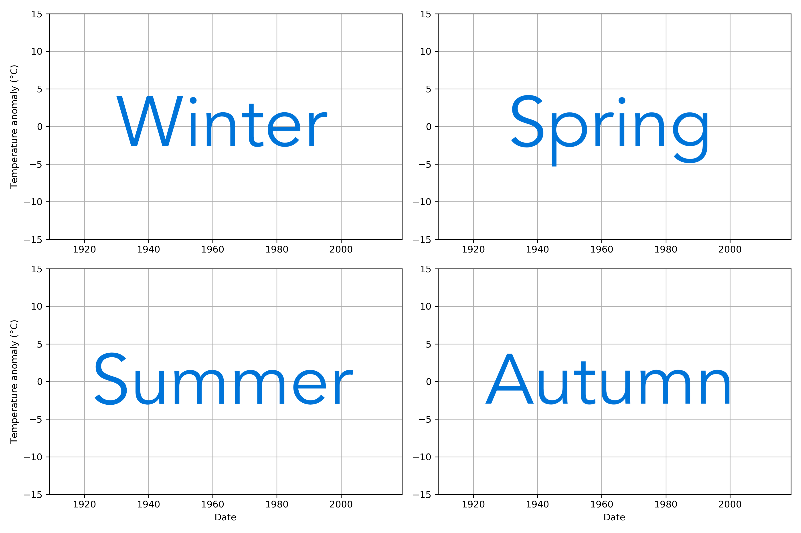

The final exercise in the Geo-Python course involves calculating and plotting seasonal weather anomalies to see how temperatures have changed in different seasons over the past 100+ years. I will be using weather data from the Sodankylä weather station in northern Finland.

## The goal

My task is to create a four-panel plot showing the seasonal temperature anomalies for winter, spring, summer, and autumn for the years 1909-2019. A template for how the final plot should look can be found below.



## The data

I have been provided a [data file](data/2315676.txt) with daily temperature data from Sodankylä from January 1908 to October 2020. The data was downloaded from the [NOAA Global Historical Climate Network database](https://www.ncdc.noaa.gov/cdo-web/datasets#GHCND) as a text file. The first five lines of the data file can be found below in order for you to see the data format.

```
STATION           STATION_NAME                                       DATE     TAVG     TMAX     TMIN     
----------------- -------------------------------------------------- -------- -------- -------- -------- 
GHCND:FI000007501                                   SODANKYLA-AWS-FI 19080101 -9999    2        -37      
GHCND:FI000007501                                   SODANKYLA-AWS-FI 19080102 -9999    6        -26      
GHCND:FI000007501                                   SODANKYLA-AWS-FI 19080103 -9999    7        -27  
```

The temperatures here are given in degrees Fahrenheit and the important columns are as follows:

- `DATE`: The date in 'YEARMODA' format, where 'YEAR' is the year using 4 digits, 'MO' is the two-digit month, and 'DA' is the day of the month.
- `TAVG`: The average daily temperature in Fahrenheit
- `TMAX`: The maximum daily temperature in Fahrenheit
- `TMIN`: The minimum daily temperature in Fahrenheit

Missing data are identified with `-9999` and more information about the data can be found on the [NOAA website](https://www.ncdc.noaa.gov/cdo-web/datasets#GHCND).

### Important note about the data!

I notice that there are many missing values in the `TAVG` column. For days where the `TAVG` values are missing, I can calculate an estimate of the average daily temperature by averaging the `TMAX` and `TMIN` values. I want to do this in a new column. 

## What to do

For this exercise I did:

1. Read in the provided data file using pandas and convert missing data to NA values.
2. Fill in the missing values in the `TAVG` column with your estimates of the average daily temperature as noted above in the data section. You can then drop any average daily temperatures that are still missing.
3. Define and use a function to convert temperatures in Fahrenheit to Celsius.
4. Calculate seasonal average temperatures for each season in every year (e.g., Winter 1909, Spring 1909, Summer 1909, ...)

    - The seasons should include the following months:
    
        - Winter: December, January, February
        - Spring: March, April, May
        - Summer: June, July, August
        - Autumn: September, October, November

5. Calculate seasonal average temperatures for the reference period 1951-1980 (e.g., 4 values in total, one for each season)
6. Calculate seasonal temperature anomalies for each year
7. Plot the data as shown in the example above


